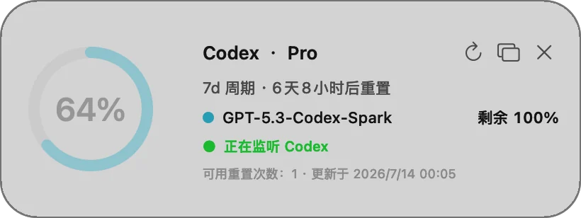

# Codex Helper

[简体中文](README.md) · [How it works](docs/how-it-works.md) · [MIT License](LICENSE)

<p align="center">
  
</p>

An open-source macOS companion for Codex. See remaining quota at a glance and safely continue the original task after a model-capacity interruption.

> Not an official OpenAI project.

## Features

- Native macOS widget, menu bar quota, and an optional floating Status Rail
- Remaining quota, reset countdowns, and color-coded quota levels
- Guarded Auto Retry for the affected Codex task
- English and Chinese UI, signed updates, official Codex news and docs

<p align="center">
  
</p>

## Install

Download the signed and Apple-notarized DMG from [GitHub Releases](https://github.com/makerjackie/codex-helper/releases), then drag it to Applications. Requires macOS 13+ and the Codex desktop app.

Native widget: Control-click the desktop → **Edit Widgets** → search for **Codex Helper**.

Quota and widgets do not need Accessibility permission. Permission is needed only when Auto Retry submits a continuation in Codex. Codex Helper never prompts for it automatically at launch or during its own tests.

## Development

```bash
git clone https://github.com/makerjackie/codex-helper.git
cd codex-helper
./test.sh
./install.sh
```

See [How it works](docs/how-it-works.md) for retry safeguards and privacy boundaries.

## License

[MIT](LICENSE)
