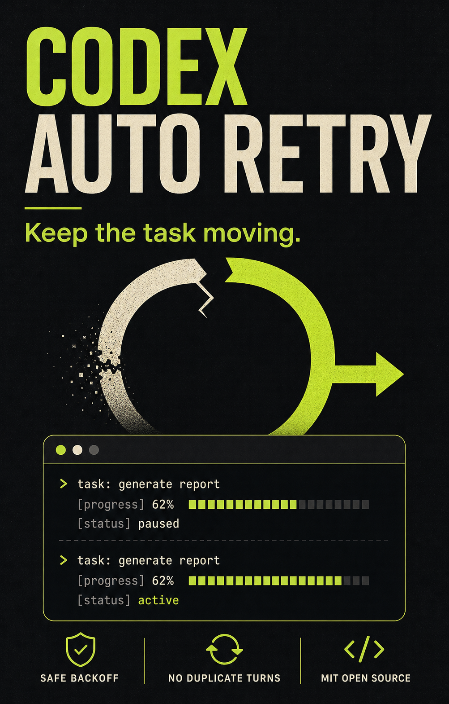

# Codex Auto Retry

[简体中文](README.zh-CN.md) · [How it works](docs/how-it-works.md) · [MIT License](LICENSE)



A tiny, open-source macOS helper that keeps a Codex task moving when the selected model is temporarily at capacity.

> Unofficial community project. Not affiliated with or endorsed by OpenAI.

## What it does

When Codex reports:

```text
Selected model is at capacity. Please try a different model.
```

Codex Auto Retry safely continues the same visible task:

1. Watches `~/.codex/log/codex-tui.log` for the exact capacity error and extracts its task ID.
2. Ignores hidden subagents and only handles tasks listed in `~/.codex/session_index.jsonl`.
3. Retries after `8 / 20 / 45 / 90 / 180 / 300` seconds, up to six times.
4. Cancels a scheduled retry if it detects that you already sent a message or a new turn started.
5. Opens `codex://threads/<thread-id>`, submits a short continuation prompt, and restores the app you were using.

It does not modify the Codex app, proxy network traffic, read project files, or store conversation content.

## Install

Requirements: macOS 13+, Codex desktop, and Xcode Command Line Tools.

```bash
git clone https://github.com/makerjackie/codex-auto-retry.git
cd codex-auto-retry
./install.sh
```

On first launch, allow **Codex Auto Retry** in **System Settings → Privacy & Security → Accessibility**. This permission is required to focus Codex and submit the retry message.

The helper starts at login through a per-user LaunchAgent.

## Language

The continuation message follows the preferred macOS language. English and Simplified Chinese are included. To override it, edit:

```text
~/Library/Application Support/CodexAutoRetry/config.json
```

Use `"language": "auto"`, `"en"`, or `"zh"`. Changes apply on the next retry.

## Status and logs

```bash
launchctl print gui/$UID/com.makerjackie.codex-auto-retry
tail -f "$HOME/Library/Application Support/CodexAutoRetry/agent.log"
```

## Uninstall

```bash
./uninstall.sh
```

Runtime logs, configuration, and retry state remain in `~/Library/Application Support/CodexAutoRetry/` so uninstalling does not silently remove your data.

## Why a helper instead of a Codex plugin?

The failure happens before a normal model turn can finish, so a task-level Skill cannot reliably resubmit it. The helper observes the local Codex log, waits outside the failed turn, and then uses the task deep link plus macOS Accessibility to continue the original task.

See [How it works](docs/how-it-works.md) for the state machine, cancellation rules, privacy model, and limitations.

## Build and test

```bash
./test.sh
```

## License

[MIT](LICENSE)
