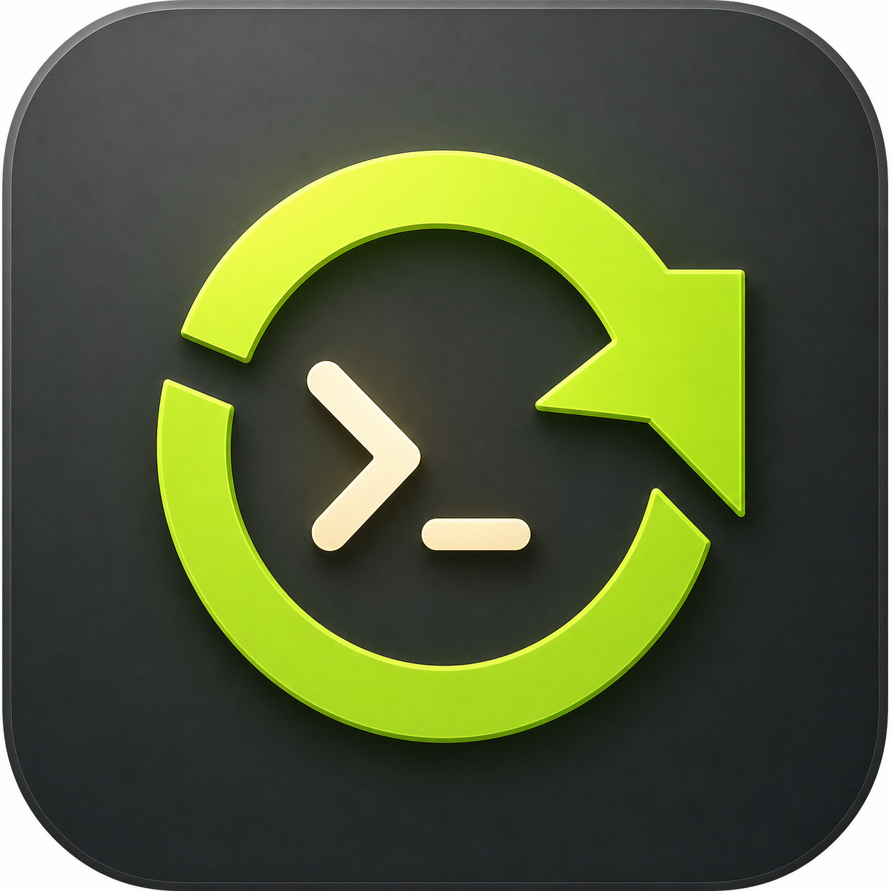
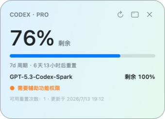

# Codex Helper

[简体中文](README.zh-CN.md) · [How it works](docs/how-it-works.md) · [Releasing](docs/releasing.md) · [MIT License](LICENSE)

<p align="center">
  
</p>

An unofficial, open-source macOS companion for Codex: a color-aware desktop quota widget, guarded Auto Retry, official updates and documentation, and signed in-app updates.

> Not affiliated with or endorsed by OpenAI.

## Download

Download the signed and Apple-notarized DMG from [GitHub Releases](https://github.com/makerjackie/codex-helper/releases), drag **Codex Helper** into Applications, and open it once.

Requirements: macOS 13+ and the Codex desktop app.

On first launch, allow **Codex Helper** in **System Settings → Privacy & Security → Accessibility**. Codex Helper needs its own permission because it is a separate app that focuses the Codex composer and submits the continuation message. If you used the earlier Codex Auto Retry prototype, this rename changes the app name, executable, bundle ID, and signing identity, so macOS treats Codex Helper as a new app and asks once more. Developer ID-signed updates with the same identity should not normally require permission again.

## Menu bar and dashboard

Click the Codex Helper menu bar icon to:

- turn Auto Retry on or off;
- see the primary Codex remaining quota percentage directly beside the menu bar icon;
- show or hide an always-on-top desktop quota widget with reset countdowns;
- see every quota window, reset time, and reset-credit count in the first-level menu;
- choose Automatic, English, or Simplified Chinese;
- enable or disable Launch at Login;
- automatically check and download signed Codex Helper updates;
- run a safe end-to-end Auto Retry test against a task you choose;
- read the latest official Codex changelog and Codex-related OpenAI news;
- open Codex documentation, troubleshooting, commands, and Tibo's X profile;
- open the dashboard, Accessibility Settings, or logs;
- quit Codex Helper completely.

You can also search for **Codex Helper** in Spotlight. Opening it again brings up the redesigned dashboard, led by quota status instead of a stack of settings cards, while keeping Auto Retry, updates, news, documentation, and general settings available on one page.

<p align="center">
  
</p>

## Auto Retry

When Codex reports:

```text
Selected model is at capacity. Please try a different model.
```

Codex Helper:

1. Watches `~/.codex/log/codex-tui.log` and extracts the affected task ID.
2. Handles only visible root tasks and ignores hidden subagents.
3. Retries after `8 / 20 / 45 / 90 / 180 / 300` seconds, up to six times.
4. Cancels if you already sent a message or a new turn started.
5. Opens the original Codex task, submits a localized continuation prompt inside Codex, and restores the app you were using.

It does not modify Codex, proxy network traffic, read project files, or store conversation content. It retries the same task; it does not automatically switch models.

## Usage

The menu bar percentage, dashboard, and desktop widget read `account/rateLimits/read` from the official local Codex App Server. The API reports `usedPercent`; Codex Helper displays the remaining quota as `100 - usedPercent`, matching the direction used by Codex itself. Quota surfaces change from blue-green at 50–100%, to amber at 10–50%, to coral-red below 10%. The widget also shows reset countdowns, reset credits, refresh, dashboard, and hide controls. Codex Helper uses the authentication already managed by Codex and never reads tokens directly from `~/.codex/auth.json`.

## Automatic updates

Automatic updates are enabled by default. Codex Helper checks the latest GitHub Release at most once per day and downloads a newer DMG in the background. Installation remains a visible **Install and Restart** action so an update never interrupts work unexpectedly.

Before replacement, Codex Helper verifies the published SHA-256 checksum, Developer ID bundle identifier and Team ID, and Gatekeeper acceptance. If the app location is not writable, it leaves the current version untouched and reports that automatic installation is unavailable.

## Verify Auto Retry without waiting for an outage

Choose **Test Auto Retry…** from the menu bar, select an idle recent Codex task with no draft in its composer, and confirm. Codex Helper creates a synthetic capacity event containing that task ID, runs it through the production matcher and visible-task check, waits three seconds, checks for newer activity, then opens the task and submits one clearly marked test message. A reply containing **Codex Helper test passed** verifies the complete routing and GUI-control chain on your installed Codex version.

During a real failure, the Codex log line contains `thread_id=<UUID>` beside the exact capacity error. Codex Helper verifies that UUID against `~/.codex/session_index.jsonl`, waits with backoff, re-checks the task for newer activity, then opens `codex://threads/<UUID>`. It submits only when Accessibility reports that Codex is frontmost and the focused composer is an empty text area; it also checks the target session afterward for the submitted prompt.

## What’s New and Learn Codex

The menu reads the public [Codex changelog RSS](https://learn.chatgpt.com/docs/changelog/rss.xml) and [OpenAI News RSS](https://openai.com/news/rss.xml), keeping only Codex-related OpenAI News items. Results are cached locally; successful feeds refresh every six hours, while failures back off for at least 15 minutes. The Tibo entry is a normal browser link; Codex Helper does not scrape X.

## Build from source

```bash
git clone https://github.com/makerjackie/codex-helper.git
cd codex-helper
./install.sh
```

Source builds use local ad-hoc signing and can require Accessibility permission again after rebuilding. For normal use, prefer the Developer ID-signed Release build.

## Test

```bash
./test.sh
```

## License

[MIT](LICENSE)
