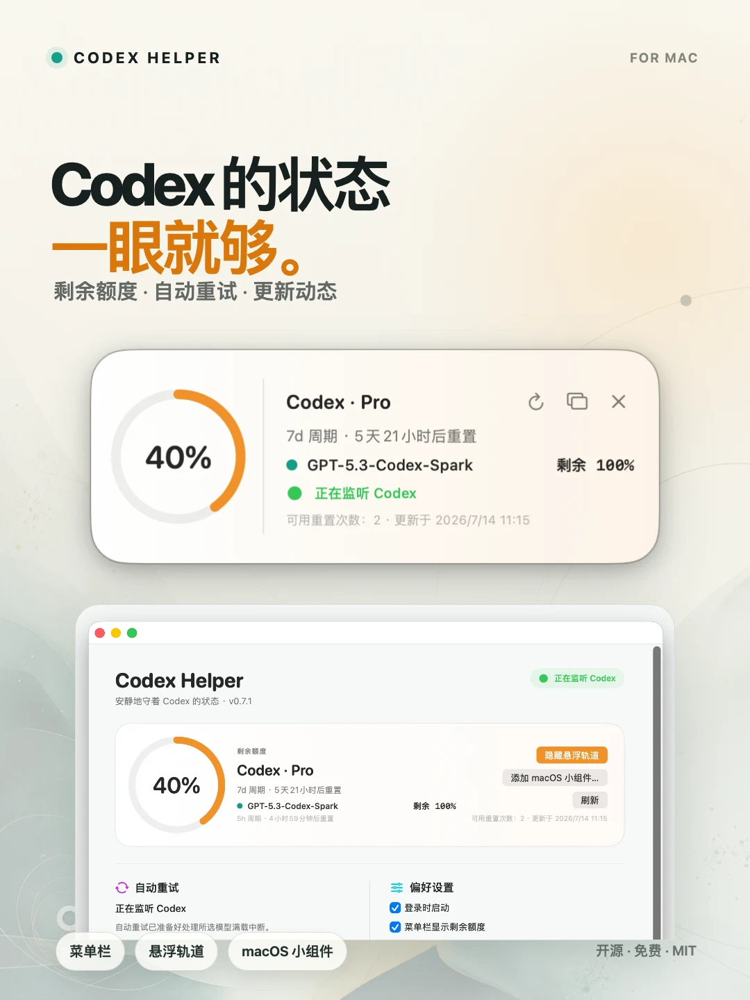

# Codex Helper

[English](README.en.md) · [工作原理](docs/how-it-works.zh-CN.md) · [MIT License](LICENSE)

<p align="center">
  <a href="assets/marketing-v0.7.1/codex-helper-promo-zh.mp4">
    
  </a>
</p>

一个开源的 macOS Codex 辅助工具。直接查看剩余额度，并在模型满载时安全续跑原任务。

> 非 OpenAI 官方项目。

## 功能

- 原生 macOS 小组件、菜单栏额度概览和可选悬浮状态轨道
- 显示剩余额度、重置倒计时与额度颜色提醒
- 模型满载后自动定位并重试原 Codex 任务
- 中英文、自动更新、Codex 官方动态与文档入口

点击上方宣传图可查看 15 秒产品短片（无配音，轻音乐）。

## 安装

从 [GitHub Releases](https://github.com/makerjackie/codex-helper/releases) 下载已经签名和 Apple 公证的 DMG，拖入“应用程序”即可。要求 macOS 13+ 和 Codex 桌面版。

原生小组件：在桌面空白处右键 → **编辑小组件** → 搜索 **Codex Helper**。

额度和小组件不需要辅助功能权限。只有开启“自动重试”并让 App 代为提交续跑消息时才需要授权；Codex Helper 不会在启动或测试时自动弹出授权请求。

## 开发

```bash
git clone https://github.com/makerjackie/codex-helper.git
cd codex-helper
./test.sh
./install.sh
```

更详细的识别、重试和隐私边界见[工作原理](docs/how-it-works.zh-CN.md)。

## License

[MIT](LICENSE)
