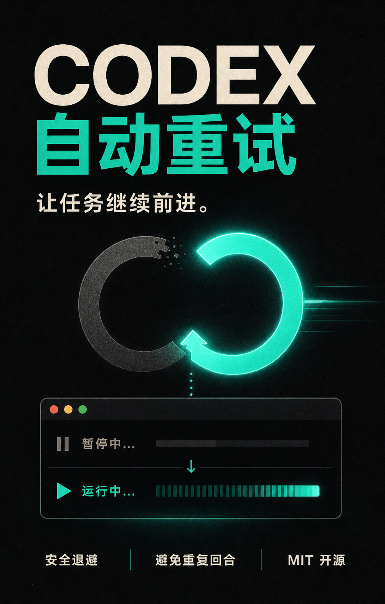

# Codex 自动重试

[English](README.md) · [工作原理](docs/how-it-works.zh-CN.md) · [MIT License](LICENSE)



一个轻量、开源的 macOS 小助手：当 Codex 所选模型暂时满载时，自动让原任务继续执行。

> 这是非官方社区项目，与 OpenAI 无隶属或背书关系。

## 它解决什么问题

当 Codex 出现：

```text
Selected model is at capacity. Please try a different model.
```

Codex 自动重试会安全地继续同一个可见任务：

1. 监听 `~/.codex/log/codex-tui.log`，识别精确的容量错误并提取任务 ID。
2. 只处理 `~/.codex/session_index.jsonl` 中的可见主任务，忽略隐藏子代理。
3. 按 `8 / 20 / 45 / 90 / 180 / 300` 秒逐步退避，最多重试 6 次。
4. 重试前检查你是否已经手动发消息、或新回合是否已经开始；若是，就取消自动重试。
5. 打开 `codex://threads/<thread-id>`，发送一条简短续跑指令，再恢复你此前使用的 App。

它不会修改 Codex App、代理网络请求、读取项目文件，也不会保存对话内容。

## 安装

要求：macOS 13+、Codex 桌面版，以及 Xcode Command Line Tools。

```bash
git clone https://github.com/makerjackie/codex-auto-retry.git
cd codex-auto-retry
./install.sh
```

首次启动时，请在 **系统设置 → 隐私与安全性 → 辅助功能** 中允许 **Codex Auto Retry**。它需要这项权限来聚焦 Codex 输入框并提交重试消息。

助手通过当前用户的 LaunchAgent 登录自启。

## 中英文支持

续跑消息会自动跟随 macOS 的首选语言，内置英文和简体中文。需要强制指定时，编辑：

```text
~/Library/Application Support/CodexAutoRetry/config.json
```

把 `language` 设置成 `"auto"`、`"en"` 或 `"zh"`。修改会在下一次重试时生效。

## 查看状态和日志

```bash
launchctl print gui/$UID/com.makerjackie.codex-auto-retry
tail -f "$HOME/Library/Application Support/CodexAutoRetry/agent.log"
```

## 卸载

```bash
./uninstall.sh
```

运行日志、配置和重试状态会保留在 `~/Library/Application Support/CodexAutoRetry/`，避免卸载时静默删除用户数据。

## 为什么不是 Codex 插件？

这个错误发生在正常模型回合完成之前，任务级 Skill 无法可靠地重新提交失败回合。这个助手在失败回合之外监听本地 Codex 日志，等待容量恢复，再通过任务深链和 macOS 辅助功能继续原任务。

完整的状态机、取消规则、隐私边界和限制见[工作原理](docs/how-it-works.zh-CN.md)。

## 构建与测试

```bash
./test.sh
```

## 开源协议

[MIT](LICENSE)
