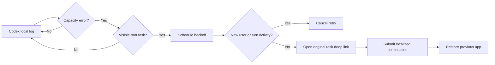

# How it works

## Design goal

Capacity is temporary. A retry helper should therefore continue the original task without creating duplicate turns, touching project data, or patching Codex itself.

## Detection

The native Swift agent tails `~/.codex/log/codex-tui.log`. It looks for the exact capacity message and extracts the UUID from `thread_id=...`. The first launch starts at end-of-file, so old failures are not replayed.

The task ID must also exist in `~/.codex/session_index.jsonl`. This deliberately excludes hidden subagent sessions.

## Backoff and deduplication

Retries use fixed progressive delays: 8, 20, 45, 90, 180, and 300 seconds. The attempt budget resets after 30 minutes without another capacity failure.

When a retry is scheduled, the agent records the current byte offset of that task's session JSONL. Immediately before submission it scans only the appended bytes. A new `user_message` or `task_started` event cancels the retry. This prevents the common duplicate-turn case where the user already continued manually.

## Submission

The helper opens `codex://threads/<thread-id>`, activates the Codex desktop app, focuses the composer, types a localized continuation message, and presses Return. It then restores the previously frontmost app.

English and Simplified Chinese prompts are built in. `config.json` can use `auto`, `en`, or `zh`; the configuration is read at submission time.

## Privacy and security

- No network service or telemetry.
- No project files are read.
- No conversation content is retained.
- Persistent state contains log cursor offsets, task IDs, timestamps, and retry counters.
- Accessibility permission is used only to synthesize the retry keystrokes.
- The app is ad-hoc signed locally during installation; it is not notarized.

## Limitations

- macOS and the Codex desktop app only.
- Depends on the current local log message, task deep-link format, and composer behavior; Codex updates may require maintenance.
- It cannot guarantee capacity has returned. It stops after six attempts.
- If Accessibility permission is missing, detection still works but submission cannot occur.
- This helper handles only the selected-model capacity error, not authentication, network, quota, or arbitrary model failures.
