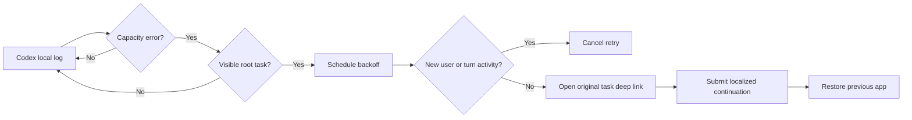

# How it works

## Design goal

Capacity is temporary. A retry helper should therefore continue the original task without creating duplicate turns, touching project data, or patching Codex itself.

## Detection

The native Swift agent tails `~/.codex/log/codex-tui.log`. It looks for the exact capacity message and extracts the UUID from `thread_id=...`. The first launch starts at end-of-file, so old failures are not replayed.

The task ID must also exist in `~/.codex/session_index.jsonl`. This deliberately excludes hidden subagent sessions.

## Backoff and deduplication

Retries use fixed progressive delays: 8, 20, 45, 90, 180, and 300 seconds. The attempt budget resets after 30 minutes without another capacity failure.

When a retry is scheduled, the agent records the current byte offset of that task's session JSONL. Immediately before submission it scans only the appended bytes. A new `user_message` or `task_started` event cancels the retry. This prevents the common duplicate-turn case where the user already continued manually.

## Submission

The helper opens `codex://threads/<thread-id>`, activates the Codex desktop app, and asks Accessibility for the focused control. It proceeds only when Codex is frontmost and that control is an empty text area. It sets and verifies the localized continuation value, presses Return, checks the target session for that prompt, and then restores the previously frontmost app.

English and Simplified Chinese prompts are built in. `config.json` can use `auto`, `en`, or `zh`; the configuration is read at submission time.

## End-to-end verification

**Test Auto Retry…** reads recent visible tasks from `session_index.jsonl` and lets the user explicitly choose an idle task with an empty draft. It generates a synthetic capacity log line for that task, passes it through the production matcher and visible-task check, records the session baseline, waits three seconds, checks for newer activity, and then runs the same guarded GUI submission path with a clearly marked prompt. It bypasses only the need to wait for a real service-side capacity failure.

## Official updates and resources

The What's New menu fetches the public Codex changelog RSS and OpenAI News RSS, filtering the broader feed for Codex. Each successfully parsed source is merged independently into the cache under Codex Helper's Application Support directory. Successful feeds refresh every six hours; failed requests back off for at least 15 minutes. Documentation and Tibo entries are plain external links; no X timeline is scraped.

## Privacy and security

- No backend service or telemetry. The What's New menu makes direct HTTPS requests only to official OpenAI public RSS feeds.
- No project files are read.
- No conversation content is retained.
- Persistent state contains log cursor offsets, task IDs, timestamps, and retry counters.
- Accessibility permission is used only to synthesize retry keystrokes targeted to the Codex process, after confirming Codex is frontmost.
- GitHub Release builds use Developer ID signing, hardened runtime, Apple notarization, and stapled tickets. Source builds installed with `install.sh` use local ad-hoc signing.

## Limitations

- macOS and the Codex desktop app only.
- Depends on the current local log message, task deep-link format, and composer behavior; Codex updates may require maintenance.
- It cannot guarantee capacity has returned. It stops after six attempts.
- If Accessibility permission is missing, detection still works but submission cannot occur.
- This helper handles only the selected-model capacity error, not authentication, network, quota, or arbitrary model failures.
