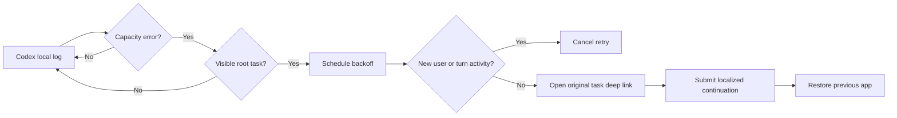

# How it works

## Design goal

Capacity is temporary. A retry helper should therefore continue the original task without creating duplicate turns, touching project data, or patching Codex itself.

## Detection

The native Swift agent reads new `codex_core::session::turn` records from Codex Desktop's current `~/.codex/logs_*.sqlite` event database. It looks for the exact capacity message and uses the record's task UUID. The first launch starts at the current database high-water mark, so old failures are not replayed. The legacy `~/.codex/log/codex-tui.log` tail remains as a compatibility fallback for older Codex builds.

The task ID must also exist in `~/.codex/session_index.jsonl`. This deliberately excludes hidden subagent sessions.

## Backoff and deduplication

Retries use fixed progressive delays: 8, 20, 45, 90, 180, and 300 seconds. The attempt budget resets after 30 minutes without another capacity failure.

When a retry is scheduled, the agent records the current byte offset of that task's session JSONL. Immediately before submission it scans only the appended bytes. A new `user_message` or `task_started` event cancels the retry. This prevents the common duplicate-turn case where the user already continued manually.

## Submission

The helper opens `codex://threads/<thread-id>`, activates the Codex desktop app, and asks Accessibility for the focused control. It proceeds only when Codex is frontmost and that control is an empty text area. It sets and verifies the localized continuation value, presses Return, checks the target session for that prompt, and then restores the previously frontmost app.

English and Simplified Chinese prompts are built in. `config.json` can use `auto`, `en`, or `zh`; the configuration is read at submission time.

## End-to-end verification

**Test Auto Retry…** reads recent visible tasks from `session_index.jsonl` and lets the user explicitly choose an idle task with an empty draft. It generates a synthetic capacity log line for that task, passes it through the production matcher and visible-task check, records the session baseline, waits three seconds, checks for newer activity, and then runs the same guarded GUI submission path with a clearly marked prompt. It bypasses only the need to wait for a real service-side capacity failure.

## Official updates and resources

The What's New menu fetches the public Codex changelog RSS and OpenAI News RSS, filtering the broader feed for Codex. Each successfully parsed source is merged independently into the cache under Codex Helper's Application Support directory. Successful feeds refresh every six hours; failed requests back off for at least 15 minutes. Documentation and Tibo entries are plain external links; no X timeline is scraped.

## Usage limits

Codex Helper verifies the OpenAI signing team of the bundled `codex` executable, starts `codex app-server --stdio`, completes the JSON-RPC initialization handshake, and calls `account/rateLimits/read`. The long-lived local subprocess refreshes every five minutes. Because `account/rateLimits/updated` notifications are sparse, each notification triggers a full refetch instead of replacing the cached snapshot. Only quota percentages, window durations, reset timestamps, plan labels, and reset-credit counts are retained in memory; authentication remains inside Codex.

The primary remaining percentage is shown beside the menu bar icon by default. The App Server reports `usedPercent`; Codex Helper presents `100 - usedPercent`, clamped to 0–100%, to match the direction used by Codex itself. Clicking once reveals every available quota window directly in the first-level menu.

Quota has two independent desktop presentations: a native WidgetKit macOS widget and the optional floating Status Rail. Both use the same snapshot, reset countdowns, and color bands: teal at 50–100%, amber at 10–50%, and pink-red below 10%. The main app writes a minimized snapshot to the team App Group `PCJ84YD7HQ.com.makerjackie.codex-helper`; the widget only reads that data and never connects to Codex directly. The draggable Status Rail can join every Space and defaults to off.

## Signed updates

The updater checks `makerjackie/codex-helper` GitHub Releases at most once per day when enabled. A newer release is downloaded only after its DMG matches the published SHA-256, Developer ID team, and Gatekeeper assessment. Before staging, the mounted app must pass a strict code-signing requirement for `com.makerjackie.codex-helper`, Team ID `PCJ84YD7HQ`, the release version, and Gatekeeper. Installation is user-triggered: a small detached updater waits for Codex Helper to exit, re-verifies both staged copies, replaces the app with a rollback backup, and reopens the verified version.

## Privacy and security

- No backend service or telemetry. Network requests go directly to official OpenAI feeds and the project's GitHub Releases API.
- No project files are read.
- No conversation content is retained.
- Persistent state contains event cursors, task IDs, timestamps, and retry counters.
- Accessibility permission is used only to synthesize retry keystrokes targeted to the Codex process, after confirming Codex is frontmost. Launch, quota refresh, and automated tests never prompt for permission; only an explicit user action does.
- GitHub Release builds use Developer ID signing, hardened runtime, Apple notarization, and stapled tickets. Source builds installed with `install.sh` use local ad-hoc signing.

## Limitations

- macOS and the Codex desktop app only.
- Depends on the current local log message, task deep-link format, and composer behavior; Codex updates may require maintenance.
- It cannot guarantee capacity has returned. It stops after six attempts.
- If Accessibility permission is missing, detection still works but submission cannot occur.
- This helper handles only the selected-model capacity error, not authentication, network, quota, or arbitrary model failures.
