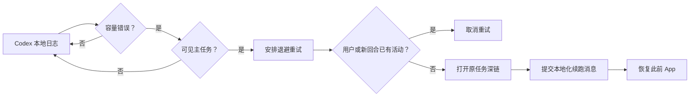

# 工作原理

## 设计目标

模型满载通常是暂时状态。自动重试应该继续原任务，同时避免重复回合、不触碰项目数据，也不修改 Codex 本体。

## 错误检测

原生 Swift 助手持续读取 `~/.codex/log/codex-tui.log` 的新增内容，匹配精确的容量错误，并从 `thread_id=...` 提取 UUID。首次启动会从文件末尾开始，因此不会重放历史错误。

任务 ID 还必须存在于 `~/.codex/session_index.jsonl`，从而主动排除隐藏的子代理会话。

## 退避与防重复

重试延迟固定为 8、20、45、90、180、300 秒。若 30 分钟内没有新的容量错误，尝试次数会重置。

安排重试时，助手会记录该任务 session JSONL 的当前字节位置。真正提交前，它只扫描后来追加的数据。若发现新的 `user_message` 或 `task_started` 事件，便取消自动重试，避免用户已经手动继续时产生重复回合。

## 续跑提交

助手打开 `codex://threads/<thread-id>`，激活 Codex 桌面版，聚焦输入框，输入本地化的续跑消息并按下回车，随后恢复此前位于前台的 App。

内置英文和简体中文。`config.json` 可设置 `auto`、`en` 或 `zh`，并且每次提交前都会重新读取，所以修改无需重装。

## 隐私与安全边界

- 没有网络服务，也没有遥测。
- 不读取项目文件。
- 不保存对话内容。
- 持久化状态只包含日志游标、任务 ID、时间戳和重试次数。
- 辅助功能权限只用于向 Codex 进程定向发送重试键盘操作，并且发送前会确认 Codex 位于前台。
- GitHub Release 版本使用 Developer ID 签名、Hardened Runtime、Apple 公证和 stapled ticket；通过 `install.sh` 构建的源码版本使用本机 ad-hoc 签名。

## 已知限制

- 只支持 macOS 和 Codex 桌面版。
- 依赖当前的本地日志文本、任务深链格式与输入框行为；Codex 更新后可能需要维护。
- 无法保证容量已经恢复；最多尝试 6 次后停止。
- 没有辅助功能权限时仍能检测错误，但不能提交消息。
- 只处理所选模型满载错误，不处理登录、网络、额度或其他模型错误。
