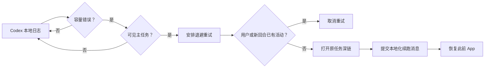

# 工作原理

## 设计目标

模型满载通常是暂时状态。自动重试应该继续原任务，同时避免重复回合、不触碰项目数据，也不修改 Codex 本体。

## 错误检测

原生 Swift 助手持续读取 `~/.codex/log/codex-tui.log` 的新增内容，匹配精确的容量错误，并从 `thread_id=...` 提取 UUID。首次启动会从文件末尾开始，因此不会重放历史错误。

任务 ID 还必须存在于 `~/.codex/session_index.jsonl`，从而主动排除隐藏的子代理会话。

## 退避与防重复

重试延迟固定为 8、20、45、90、180、300 秒。若 30 分钟内没有新的容量错误，尝试次数会重置。

安排重试时，助手会记录该任务 session JSONL 的当前字节位置。真正提交前，它只扫描后来追加的数据。若发现新的 `user_message` 或 `task_started` 事件，便取消自动重试，避免用户已经手动继续时产生重复回合。

## 续跑提交

助手打开 `codex://threads/<thread-id>` 并激活 Codex 桌面版，再通过辅助功能读取当前聚焦控件。只有 Codex 位于前台、该控件是空白文本输入区时才会继续；助手设置并验证本地化续跑消息，按下回车，检查目标 session 是否出现该消息，随后恢复此前位于前台的 App。

内置英文和简体中文。`config.json` 可设置 `auto`、`en` 或 `zh`，并且每次提交前都会重新读取，所以修改无需重装。

## 端到端验证

**测试自动重试…** 会从 `session_index.jsonl` 读取最近的可见任务，让用户明确选择一个空闲且没有输入框草稿的任务。它会为该任务生成一条模拟容量日志，交给正式匹配器和可见任务检查处理，记录 session 基线，等待 3 秒并检查新活动，再运行同一条受保护的 GUI 提交链路。它只跳过“等待真实服务端容量错误”这一步。

## 官方动态与资源

“最新动态”菜单读取公开的 Codex Changelog RSS 和 OpenAI News RSS，并对后者筛选 Codex 内容。每个成功解析的来源会独立合并到 Codex Helper 的 Application Support 缓存；成功来源每 6 小时刷新，失败请求至少退避 15 分钟。文档和 Tibo 项均为普通外部链接，不抓取 X 时间线。

## 额度使用情况

Codex Helper 会先验证随 App 提供的 `codex` 可执行文件属于 OpenAI 签名团队，再启动 `codex app-server --stdio`，完成 JSON-RPC 初始化后调用 `account/rateLimits/read`。这个本地常驻子进程每 5 分钟刷新；由于 `account/rateLimits/updated` 是稀疏通知，收到通知后会重新读取完整快照，不会用缺省字段覆盖现有数据。内存中只保留额度比例、窗口长度、重置时间、套餐标签和重置次数；认证仍完全由 Codex 管理。

## 签名更新

开启自动更新后，Updater 每天最多检查一次 `makerjackie/codex-helper` GitHub Releases。新 DMG 必须先匹配发布的 SHA-256、Developer ID 团队并通过 Gatekeeper，之后才会挂载。挂载后的 App 还必须通过严格签名要求，精确匹配 `com.makerjackie.codex-helper`、Team ID `PCJ84YD7HQ` 和 Release 版本。安装需要用户主动点击；独立更新进程会等待 Codex Helper 退出，再次验证暂存副本，以带回滚备份的方式替换 App，并重新打开验证后的版本。

## 隐私与安全边界

- 没有后端服务或遥测；网络请求只会直接访问 OpenAI 官方公开 RSS 和项目 GitHub Releases API。
- 不读取项目文件。
- 不保存对话内容。
- 持久化状态只包含日志游标、任务 ID、时间戳和重试次数。
- 辅助功能权限只用于向 Codex 进程定向发送重试键盘操作，并且发送前会确认 Codex 位于前台。
- GitHub Release 版本使用 Developer ID 签名、Hardened Runtime、Apple 公证和 stapled ticket；通过 `install.sh` 构建的源码版本使用本机 ad-hoc 签名。

## 已知限制

- 只支持 macOS 和 Codex 桌面版。
- 依赖当前的本地日志文本、任务深链格式与输入框行为；Codex 更新后可能需要维护。
- 无法保证容量已经恢复；最多尝试 6 次后停止。
- 没有辅助功能权限时仍能检测错误，但不能提交消息。
- 只处理所选模型满载错误，不处理登录、网络、额度或其他模型错误。
